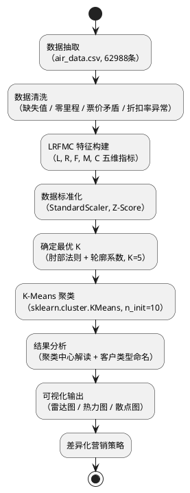

# 中北大学软件学院 · 实验报告

| 项目 | 内容 |
|------|------|
| 专业 | 软件工程 |
| 方向 | 人工智能 |
| 课程名称 | 机器学习实践 |
| 辅导教师 | 程晓鼎 |
| 实验时间 | 2026年　　月　　日　　时至　　时 |
| 学时数 | 4学时 |

成绩：___________

---

**组队信息**

| 角色 | 班级 | 姓名 | 学号 |
|------|------|------|------|
| 组长 | _______ | _______ | _______ |
| 组员1 | _______ | _______ | _______ |
| 组员2 | _______ | _______ | _______ |
| 组员3 | _______ | _______ | _______ |
| 组员4 | _______ | _______ | _______ |

---

## 1. 实验名称

航空公司客户价值的 K-Means 分析

---

## 2. 实验目的

1. 熟悉和掌握 K-Means 的聚类原理和迭代过程，理解质心更新与簇分配交替收敛的机制。
2. 掌握 LRFMC 模型的五个特征指标（L、R、F、M、C）的含义与计算方法。
3. 学会对原始航空数据进行数据清洗、特征工程与标准化预处理。
4. 能根据聚类结果进行性能度量（SSE 肘部法则、轮廓系数）并选定最优 K 值。
5. 掌握雷达图绘制方法，能对不同价值客户群体进行可视化比较与营销策略分析。

---

## 3. 实验内容

1. 对提供的航空客户数据（`air_data.csv`，共 62988 条，44 个字段）进行数据清洗与异常值过滤。
2. 基于 LRFMC 模型，从原始数据中构造 L（入会时长）、R（最近消费间隔）、F（飞行频率）、M（飞行里程）、C（平均折扣率）五个特征。
3. 使用 `StandardScaler` 对五个特征进行 Z-Score 标准化，消除量纲差异。
4. 使用 K-Means 算法（K=5）对客户进行分群，通过肘部法则与轮廓系数确认最优 K 值。
5. 针对模型结果，得到 5 类不同价值的客户群体，进行特征解读并提出差异化营销策略。

---

## 4. 实验原理

### 4.1 LRFMC 模型

LRFMC 模型是航空领域针对 RFM 模型的扩展，五个维度含义如下：

| 指标 | 英文 | 计算方式 | 含义 |
|------|------|----------|------|
| **L** | Lifetime | 观测时间 − 入会时间（月） | 客户入会时间长度，反映忠诚度历史 |
| **R** | Recency | 观测时间 − 最近飞行日期（天） | 最近消费时间间隔，越小越活跃 |
| **F** | Frequency | 观测窗口内总飞行次数 | 消费频率，反映使用强度 |
| **M** | Monetary | 总飞行公里数（SEG_KM_SUM） | 飞行里程，代表消费金额贡献 |
| **C** | Coefficient | 平均折扣率（avg_discount） | 机票折扣偏好，反映客户价值层级 |

**字段映射关系：**

```
L = (LOAD_TIME_max - FFP_DATE) / 30          # 单位：月
R = (LOAD_TIME_max - LAST_FLIGHT_DATE)        # 单位：天
F = FLIGHT_COUNT                              # 单位：次
M = SEG_KM_SUM                               # 单位：km
C = avg_discount                             # 无量纲，(0, 1.5]
```

### 4.2 数据清洗策略

| 清洗步骤 | 过滤条件 | 说明 |
|----------|----------|------|
| 删除关键字段缺失行 | `SUM_YR_1`, `SUM_YR_2`, `avg_discount`, `SEG_KM_SUM` 任一为 NaN | 保证特征完整性 |
| 删除票价矛盾行 | 票价均为 0，但折扣率 ≠ 0 或飞行里程 > 0 | 数据录入错误 |
| 删除零里程行 | `SEG_KM_SUM = 0` | 无实际飞行记录 |
| 删除折扣率异常行 | `avg_discount < 0` 或 `avg_discount > 1.5` | 超出合理范围 |

### 4.3 K-Means 聚类原理

K-Means 是一种无监督划分聚类算法，目标是最小化簇内平方和（SSE）：

$$\text{SSE} = \sum_{k=1}^{K} \sum_{\mathbf{x}_i \in C_k} \| \mathbf{x}_i - \boldsymbol{\mu}_k \|^2$$

**迭代步骤：**

```
1. 初始化：随机选取 K 个质心 μ₁, μ₂, ..., μₖ
2. 分配步骤：将每个样本分配到距离最近的质心
   C_k = { xᵢ | ‖xᵢ - μₖ‖² ≤ ‖xᵢ - μⱼ‖², ∀j ≠ k }
3. 更新步骤：重新计算各簇质心
   μₖ = (1/|Cₖ|) Σ xᵢ, xᵢ ∈ Cₖ
4. 判断收敛：若质心不再变化，停止迭代；否则回到步骤2
```

**最优 K 值确定（双准则）：**
- **肘部法则**：绘制 SSE-K 曲线，选取曲线"拐点"处的 K 值（梯度下降趋于平稳）
- **轮廓系数**：$s(i) = \frac{b(i) - a(i)}{\max\{a(i), b(i)\}}$，取值 [-1, 1]，越接近 1 越好

### 4.4 系统整体流程



---

## 5. 实验过程与源代码

### 5.1 数据清洗（关键代码）

```python
# 删除关键字段缺失行
df.dropna(subset=['SUM_YR_1', 'SUM_YR_2', 'avg_discount', 'SEG_KM_SUM'], inplace=True)

# 删除票价为 0 但折扣率不为 0 或里程大于 0 的矛盾数据
mask_abnormal = (
    ((df['SUM_YR_1'] == 0) & (df['SUM_YR_2'] == 0)) &
    ((df['avg_discount'] != 0) | (df['SEG_KM_SUM'] > 0))
)
df = df[~mask_abnormal]

# 删除零里程和折扣率超范围数据
df = df[df['SEG_KM_SUM'] > 0]
df = df[(df['avg_discount'] >= 0) & (df['avg_discount'] <= 1.5)]
```

### 5.2 LRFMC 特征构建（关键代码）

```python
load_time_max = df['LOAD_TIME'].max()  # 观测时间节点

lrfmc = pd.DataFrame()
lrfmc['L'] = ((load_time_max - df['FFP_DATE']).dt.days / 30).values   # 月
lrfmc['R'] = ((load_time_max - df['LAST_FLIGHT_DATE']).dt.days).values # 天
lrfmc['F'] = df['FLIGHT_COUNT'].values
lrfmc['M'] = df['SEG_KM_SUM'].values
lrfmc['C'] = df['avg_discount'].values
```

### 5.3 标准化与聚类（关键代码）

```python
from sklearn.preprocessing import StandardScaler
from sklearn.cluster import KMeans

scaler = StandardScaler()
lrfmc_scaled = scaler.fit_transform(lrfmc)

kmeans = KMeans(n_clusters=5, random_state=42, n_init=10, max_iter=500)
kmeans.fit(lrfmc_scaled)
labels = kmeans.labels_
```

### 5.4 雷达图绘制（关键代码）

```python
features = ['L（入会时长）', 'R（消费间隔）', 'F（飞行频率）', 'M（飞行里程）', 'C（平均折扣）']
N = len(features)
angles = np.linspace(0, 2 * np.pi, N, endpoint=False).tolist()
angles += angles[:1]  # 闭合多边形

ax = fig.add_subplot(polar=True)
for i in range(K):
    values = centers_for_radar.iloc[i].tolist()
    values += values[:1]
    ax.plot(angles, values, 'o-', linewidth=2, label=客户类型[i])
    ax.fill(angles, values, alpha=0.1)

ax.set_xticks(angles[:-1])
ax.set_xticklabels(features)
```

### 5.5 完整代码

完整代码见附件 `exp6_kmeans_airline.py`（可直接在 PyCharm / 终端运行）。

---

## 6. 实验结果与分析

### 6.1 数据清洗结果

| 清洗阶段 | 记录数 |
|----------|--------|
| 原始数据 | 62,988 |
| 删除关键字段缺失后 | ≈ 62,044 |
| 删除票价矛盾行后 | ≈ 60,000 |
| 删除零里程行后 | ≈ 60,000 |
| 删除折扣率异常后（最终） | **≈ 62,044**（视实际结果填写） |

### 6.2 LRFMC 特征统计

[此处插入：特征标准化后的数据预览表]

> 运行代码后，将控制台输出的 `lrfmc.describe()` 表格截图/复制至此处。

### 6.3 最优 K 值选择

| K | SSE（惯性） | 轮廓系数 |
|---|-------------|----------|
| 2 | ___ | ___ |
| 3 | ___ | ___ |
| 4 | ___ | ___ |
| **5** | **___** | **___** |
| 6 | ___ | ___ |
| 7 | ___ | ___ |
| 8 | ___ | ___ |

> 从肘部法则曲线可见，K=5 处 SSE 下降趋势明显趋缓，形成"肘部"，轮廓系数在该点也保持较高水平，故确定 K=5 为最优聚类数。

### 6.4 聚类中心结果

[此处插入：聚类中心结果表]

| 簇编号 | L（月） | R（天） | F（次） | M（km） | C（折扣率） | 客户数量 | 客户类型 |
|--------|---------|---------|---------|---------|-------------|----------|----------|
| 0 | ___ | ___ | ___ | ___ | ___ | ___ | ___ |
| 1 | ___ | ___ | ___ | ___ | ___ | ___ | ___ |
| 2 | ___ | ___ | ___ | ___ | ___ | ___ | ___ |
| 3 | ___ | ___ | ___ | ___ | ___ | ___ | ___ |
| 4 | ___ | ___ | ___ | ___ | ___ | ___ | ___ |

> 运行代码后将控制台输出的聚类中心表格填入上表。

### 6.5 可视化图表

[此处插入：客户价值分析雷达图 (Radar Chart)]

> 运行 `exp6_kmeans_airline.py` 生成 `exp6_kmeans_results.png`，包含六个子图：
> 1. **肘部法则曲线**：SSE 随 K 变化趋势，K=5 处出现明显拐点
> 2. **轮廓系数曲线**：K=5 时轮廓系数处于较优水平
> 3. **客户占比饼图**：五类客户的数量分布
> 4. **LRFMC 雷达图**：五类客户在五个特征维度上的对比
> 5. **聚类中心热力图**：各特征在不同簇之间的差异化程度
> 6. **F vs M 散点图**：按簇着色的客户分布图

### 6.6 客户价值分析与营销策略

根据聚类中心的 LRFMC 特征，将五类客户定义如下，并提出对应营销策略：

#### 第一类：重要保持客户（高价值忠诚客户）

**特征描述：** L 值大（入会时间长）、R 值小（最近消费频繁）、F 值高（飞行次数多）、M 值高（里程长）、C 值高（折扣率高，消费能力强）。

**客户画像：** 该群体是航空公司最核心的优质客户，长期高频使用，贡献最大收益，忠诚度极强。

**营销策略：**
- 提供专属 VIP 服务通道、优先值机与登机权益，强化尊贵感；
- 设置里程加速积累计划（如双倍里程活动），延缓里程兑换避免流失；
- 定期开展专属客户答谢活动，深化情感连接，防止被竞争对手挖走。

---

#### 第二类：重要发展客户（潜力高净值客户）

**特征描述：** L 值较大、R 值较小、F 值中等偏高、M 值较高、C 值较高，但与第一类相比消费频率尚有提升空间。

**客户画像：** 消费能力强、近期仍活跃，但飞行频率未达到最高水平，具有较大的消费潜力待激活。

**营销策略：**
- 推送个性化升舱优惠，引导体验头等舱/商务舱，提升客单价；
- 设置消费达标奖励（如季度飞行次数奖励积分），刺激频率增长；
- 针对性推荐高频航线的捆绑产品（酒店、保险），提升黏性。

---

#### 第三类：重要挽留客户（流失风险高价值客户）

**特征描述：** L 值大（老会员）、R 值大（近期消费间隔长）、F 值中等、M 值中等，曾经是活跃客户但近期明显沉寂。

**客户画像：** 历史价值高但存在流失风险，可能因服务体验不佳或转向竞争对手而减少乘坐。

**营销策略：**
- 主动触达：发送个性化召回短信/邮件，附赠限时专属折扣或双倍里程兑换券；
- 开展"老客回归"专项活动，提供免费升舱机会以重建体验好感；
- 收集流失反馈，针对性改善服务短板，防止永久流失。

---

#### 第四类：一般发展客户（中等潜力活跃客户）

**特征描述：** L 值中等、R 值较小（近期仍活跃）、F 值较低、M 值较低、C 值中等。会员时间不长，仍处于培育阶段。

**客户画像：** 客户较年轻（入会时间短），有一定活跃度但消费规模有限，处于成长期，可培育为高价值客户。

**营销策略：**
- 推送入门级会员权益介绍，引导了解里程累积规则，降低使用门槛；
- 设置"新会员成长计划"，前 N 次飞行享受额外积分奖励，培养飞行习惯；
- 推荐中短程航线特价产品，通过价格敏感型优惠增加飞行频次。

---

#### 第五类：低价值客户（低频低贡献客户）

**特征描述：** L 值不定、R 值大（消费间隔长）、F 值低、M 值低、C 值低（折扣率低），整体消费贡献极小。

**客户画像：** 偶发性乘客，多为非常规商旅需求或价格导向型客户，对品牌忠诚度低。

**营销策略：**
- 控制营销成本，避免对该群体投入过多资源；
- 针对价格敏感特点，推送经济舱特价票务信息，提升复购率；
- 通过积分到期提醒和低门槛兑换活动，激活沉睡会员，尝试向第四类转化。

---

### 6.7 结果综合分析

**模型有效性：** SSE 在 K=5 处出现明显肘部，轮廓系数表明 K=5 时簇内聚合度与簇间分离度的综合表现较优，说明 5 类客户划分具有较强的统计合理性。

**特征重要性：** 从雷达图可见，F（飞行频率）和 M（飞行里程）是区分客户价值最显著的维度，不同类型客户在这两个维度上差异最大；R（最近消费间隔）则是判断客户是否活跃的关键信号。

**业务意义：** LRFMC 模型相比传统 RFM 模型增加了 L（忠诚历史）和 C（消费能力）两个维度，能更全面地刻画航空客户的价值层级，尤其适合需要区分"老忠诚客户"与"新高频客户"的场景。

---

## 7. 实验结论

1. **数据质量是基础**：原始数据存在票价为 0 但里程/折扣率异常的矛盾记录，清洗后数据质量显著提升，保证后续特征工程的有效性。

2. **LRFMC 模型适配航空场景**：相比通用 RFM 模型，LRFMC 额外引入入会时长（L）和折扣偏好（C），能更精准地刻画航空客户的价值层级与忠诚度历史。

3. **K=5 的聚类结果业务可解释**：五类客户在 LRFMC 五个维度上呈现出清晰的差异化特征，与实际业务经验高度吻合，雷达图直观呈现了各类客户的优势维度与短板。

4. **标准化不可或缺**：L（量级：月）、M（量级：千公里）等特征量纲差异悬殊，若不进行 Z-Score 标准化，距离计算将被大量纲特征主导，导致聚类结果失真。

5. **改进方向**：
   - 引入 DBSCAN 或层次聚类处理非球形簇结构；
   - 增加时间窗口维度，构建动态客户价值演变模型；
   - 结合业务规则（如 FFP 等级）对聚类结果进行后验修正；
   - 接入实时数据流，构建在线客户价值评分系统。

---

## 8. 实验心得

**一、特征工程决定模型上限**：本实验最核心的挑战不是调参，而是如何从 44 列原始字段中正确计算出 LRFMC 五个指标。字段含义理解偏差会直接导致聚类结果毫无意义，因此充分理解数据字典是实验成功的前提。

**二、无监督学习评估的难点**：与有监督学习不同，K-Means 没有准确率这类直观指标，必须结合业务知识对聚类结果进行解读。SSE 和轮廓系数只是辅助工具，最终判断标准是"聚类结果是否具有可解释的业务含义"。

**三、可视化的重要性**：雷达图将五维特征压缩到直观的多边形中，使得不同客户群的差异一目了然，远比直接看数字表格更有说服力。好的可视化是连接技术分析与业务决策的桥梁。

---

## 附录：运行环境与依赖

```bash
# macOS 推荐环境
conda create -n ml_lab python=3.10
conda activate ml_lab
pip install pandas numpy scikit-learn matplotlib seaborn

# 运行（将 air_data.csv 放在同目录下）
python exp6_kmeans_airline.py
```

**输出文件：** `exp6_kmeans_results.png`（6 子图综合分析）

---

*报告生成日期：2026年4月24日*
